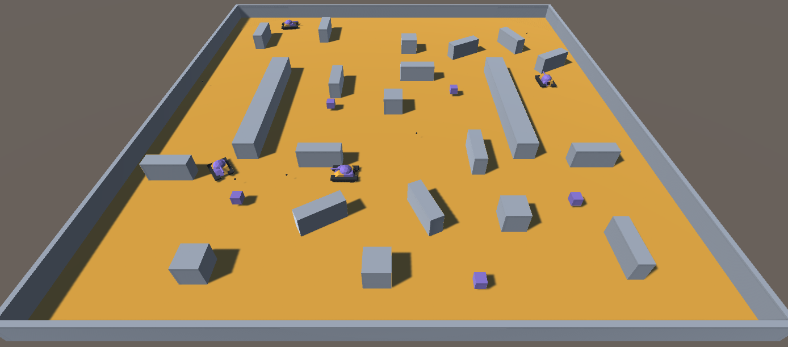

# Tank Intelligent Agents Using Unity ML-Agents

This is a small Tank game built in order to experiment with the [Unity ML-Agents Toolkit](https://github.com/Unity-Technologies/ml-agents) as part of project for the [INF8225 class of Polytechnique Montréal](https://www.polymtl.ca/etudes/cours/iatech-probabilistes-et-dapprentissage). In this game, tanks are controlled by AI models that were trained with the PPO algorithm.

## Requirements
- Unity 2019.2.17 or higher
- ML-Agents Toolkit 0.15.1

## Configuration
Edit the `Packages/manifest.json` to point the ml-agents package to the right repository. Once this is done, the project can be opened in Unity. Different trained models are available in `Assets/Tank/TF_Models`. In the Unity editor, it is possible to edit the tank prefab to select the model to use.

## Tanks in action

